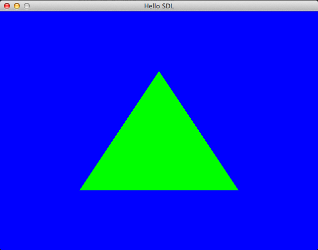

Example03
=========

Drawing a green triangle over a blue background.

Code is ported from the first part of https://open.gl/drawing

### How to run:

```sh
cabal run example03 src/Examples/Example03/position.vert src/Examples/Example03/color.frag
```


